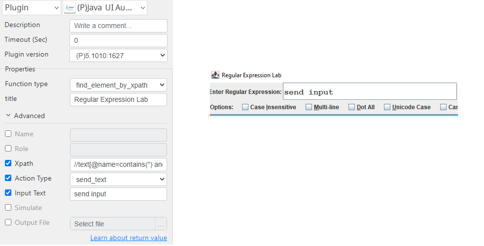

# Java UI Automation

***Java UI Automation with this plug-in can control java ui interface.***

## Java UI Automation
| Item         |              Value               |
|--------------|:--------------------------------:|
| Icon         |   |
| Display Name |      **Java UI Automation**      |

### Arun Kumar (arunk@argos-labs.com)

Arun Kumar
* [email](mailto:arunk@argos-labs.com) 
 
## Version Control 
* [4.823.1735](setup.yaml)
* Release Date: `August 23, 2022`

## Prerequisite
* 64-bit Windows
* Java >= 8 (https://docs.aws.amazon.com/corretto/latest/corretto-8-ug/downloads-list.html) If you are doing development install JDK, otherwise JRE is enough
* Enable the Java Access Bridge in windows   C:\path\to\java\bin\jabswitch -enable
* Access Bridge Explorer is a Windows application that allows exploring, as well as interacting with, the Accessibility tree of any Java applications   https://github.com/google/access-bridge-explorer
## Input (Required)
| Function type             | Parameters   | Output     |
|---------------------------|--------------|------------|
| find_element_by_name      | title        |            |
|                           | Name         |            |
|                           | Action Type  |            |
| find_element_by_role      | title        |            |
|                           | Role         |            |
|                           | Action Type  |            |
| find_element_by_xpath     | title        |            |
|                           | Xpath        |            |
|                           | Action Type  |            |
| print_all_xpath           | title        | xpath list |
|                           | Output File  |            |

### Notes:-
<ul>
    <li> Simulate:- use incase of Simulate error. </li>
    <li> Input Text:- requied when send input or select dropdown. </li>
</ul>

## Return Value

### Normal Case
Description of the output result

## Return Code
| Code | Meaning                      |
|------|------------------------------|
| 0    | Success                      |
| 1    | Exceptional case             |

## Output Format
You may choose one of 3 output formats below,

<ul>
  <li>String (default)</li>
  <li>CSV</li>
  <li>File</li>
</ul>  

## Parameter setting examples (diagrams)

## Operations

### Find Element and send input:

